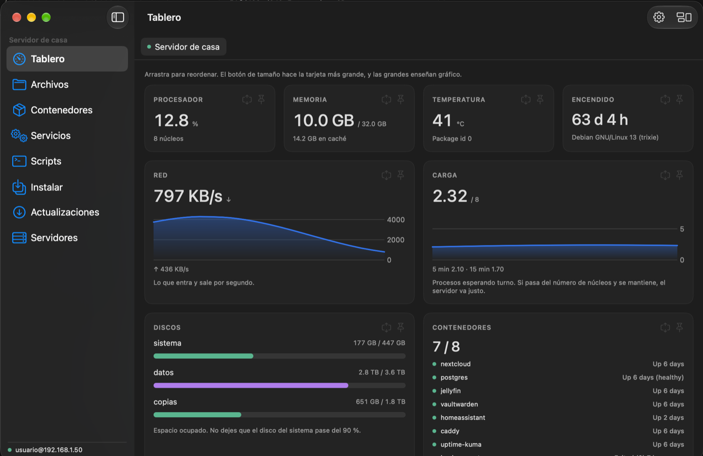
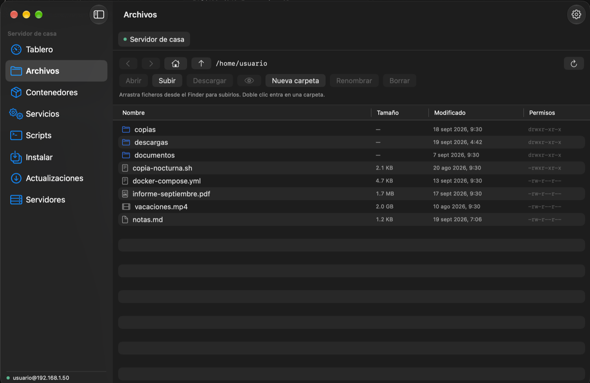
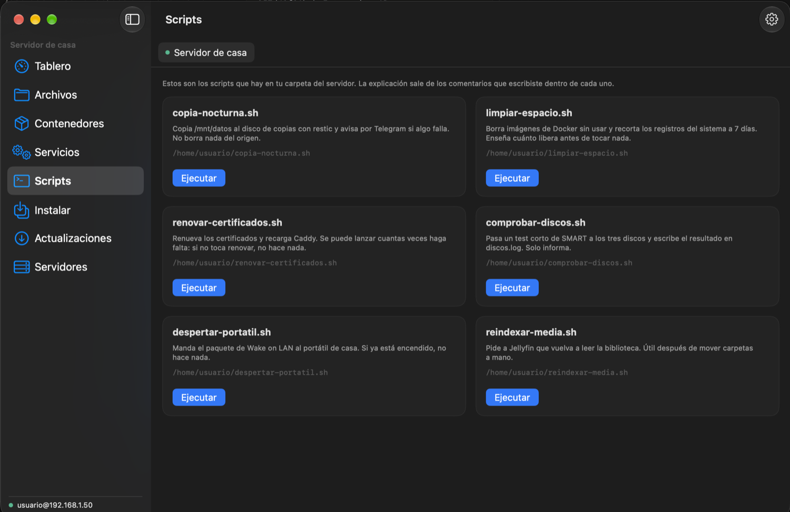
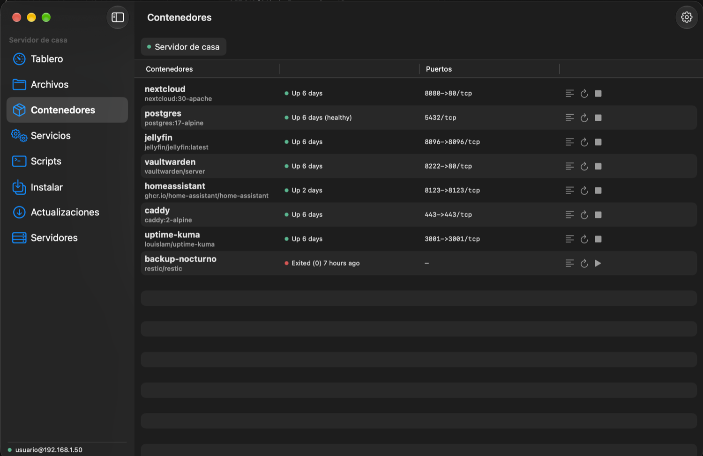
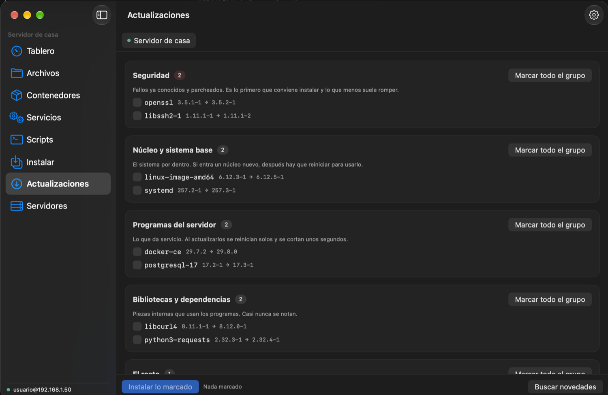

# Atalaya

[English](README.md) · **Español**

**Tu servidor Linux, a la vista: por SSH y sin instalarle nada.**

<p align="center">
  
</p>

Todos los paneles de servidor empiezan pidiéndote que instales algo: un agente,
un panel web, un contenedor, un puerto abierto. Atalaya no pide nada de eso.
Entra por SSH, igual que entras tú, y lee lo que hay.

## Qué enseña

- **Tablero en vivo**: procesador, memoria, carga, temperatura, red y discos,
  con la frecuencia que tú elijas.
- **Tarjetas que colocas tú**: las arrastras al orden en el que de verdad las
  miras, las haces más anchas, y las anchas sacan gráfico.
- **Contenedores**: todos los de Docker con su estado, y arrancar, parar,
  reiniciar y ver el registro.
- **Servicios**: lo que systemd tiene en marcha, con una explicación en
  cristiano de para qué sirve cada uno de los habituales. Se acabó preguntarse
  qué es `chrony`.
- **Tus scripts, con botón**: Atalaya encuentra los `.sh` de tu carpeta y te
  explica cada uno **con los comentarios que tú escribiste dentro**. Los lanzas y
  ves la salida llegar en directo.
- **Actualizaciones por grupos**: seguridad, núcleo, programas, bibliotecas y el
  resto, con casillas. Eliges qué se instala. Solo actualiza paquetes que ya
  están instalados; nunca añade programas nuevos.
- **Ficheros por SFTP**: navegas el servidor, arrastras desde el Finder para
  subir, descargas con barra de progreso, miras con Vista Rápida, creas
  carpetas, renombras y borras. Por la misma conexión SSH, sin montar nada más.
  Vuelve a abrirse en la última carpeta que estabas mirando.
- **Instalar desde un repositorio**: pegas la dirección de un proyecto con
  Docker Compose. Atalaya te enseña qué imágenes usa, qué puertos pide y si
  alguno está ocupado, y solo lo levanta cuando das el visto bueno.
- **Varios servidores**: cada uno se abre en una pestaña, así que saltas de
  máquina como saltas de página en el navegador.

<p align="center">
  
  
</p>

<p align="center">
  
  
</p>

> Las capturas están hechas en modo demostración (`ATALAYA_DEMO=1`), con
> servidores y scripts inventados. Ahí no hay ninguna máquina real.

## Qué no hace

- No llama a casa. La app habla con tu servidor y con nadie más.
- No instala agentes, ni demonios, ni paneles web en tu servidor.
- No guarda contraseñas en ficheros: van al llavero de macOS.
- No te reinicia `ssh`, porque así es como te quedas fuera de tu propia máquina.

## Requisitos

- macOS 14 o más nuevo, Apple Silicon o Intel.
- Un servidor Linux al que llegues por SSH con un usuario que pueda entrar.
- Opcional: `sudo` para actualizar el sistema, reiniciar servicios y apagar. Lo
  de Docker necesita un usuario en el grupo `docker`.

## Instalación

**[⬇ Descargar Atalaya 1.0.0](https://github.com/neural-beat/atalaya/releases/latest/download/Atalaya-1.0.0.zip)**

> **Descarga `Atalaya-1.0.0.zip`, no "Source code (zip)".** El archivo de código
> fuente contiene el código, no la aplicación: dentro no hay ninguna `.app`.


1. Descarga la app de Releases, descomprímela y arrastra `Atalaya.app` a tu
   carpeta de Aplicaciones.
2. **Clic derecho en la app → Abrir → Abrir.** Atalaya está firmada pero no
   notarizada por Apple, así que un doble clic normal será rechazado la primera
   vez.
3. Añade tu servidor: máquina, usuario y contraseña o tu clave SSH.

Si la máquina ya está en tu `~/.ssh/known_hosts`, Atalaya solo acepta esa llave.
Si no está, se confía en la primera conexión y la app te lo advierte.

## Compilarla tú

```bash
git clone https://github.com/neural-beat/atalaya.git
cd atalaya
./build.sh
open build/Atalaya.app
```

`Tools/setup-signing.sh` crea una identidad de firma local y estable para que
macOS trate cada recompilación como la misma app. Es gratis y sin conexión; no
es la notarización de Apple.

## Actualizaciones

Atalaya pregunta a GitHub una vez al día y te avisa cuando hay una versión más
nueva. Nunca descarga ni instala nada por su cuenta: te lleva a la página de la
publicación. También puedes comprobarlo cuando quieras desde la ventana de
información.

## Licencia

GPL-3.0-or-later. Hecha por [neural-beat](https://github.com/neural-beat).
